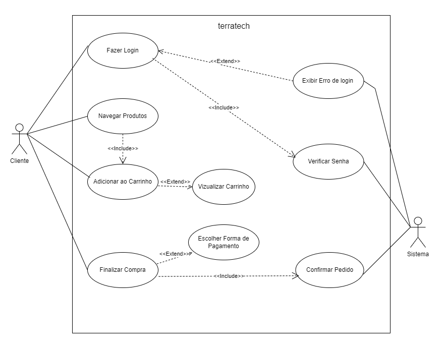

# Grupo-3
# Sumário

- [História](#história)
- [Segmento](#segmento)
- [Nicho](#nicho)
- [Público-Alvo](#público-alvo)
- [Funcionalidades do Ecommerce](#funcionalidades-do-ecommerce)
- [O que o ecommerce tem?](#o-que-o-ecommerce-tem)
- [Categorias](#categorias)
- [O que ele faz?](#o-que-ele-faz)
- [Usuários e Permissões](#usuários-e-permissões)
- [Quem são os usuários?](#quem-são-os-usuários)
- [Quais as permissões dos usuários?](#quais-as-permissões-dos-usuários)
- [Funcionário](#funcionário)
- [Cliente](#cliente)
- [Diagrama caso de uso Terratech](#diagrama-caso-de-uso-terratech)
- [Autores](#Autores)
        
## História 

A TerraTech Store nasceu da crescente preocupação com o impacto ambiental da tecnologia e a necessidade de integrar soluções sustentáveis ao nosso cotidiano. Observando o aumento da demanda por produtos que fossem ao mesmo tempo inovadores e ecologicamente responsáveis, um grupo de jovens empreendedores decidiu criar uma plataforma que unisse tecnologia e sustentabilidade. 

A ideia surgiu durante uma conversa sobre como o mercado de eletrônicos estava saturado de produtos descartáveis e pouco eficientes em termos de energia. A TerraTech Store foi criada para oferecer uma alternativa, focada em produtos tecnológicos que não apenas atendem às necessidades modernas, mas também contribuem para um planeta mais saudável. 

Desde o início, nossa missão foi clara: facilitar o acesso a produtos que combinam inovação e consciência ambiental, ajudando nossos clientes a fazer escolhas mais sustentáveis sem sacrificar a qualidade ou o desempenho. Hoje, a TerraTech Store se orgulha de ser um ponto de referência para quem busca integrar sustentabilidade em seu estilo de vida, oferecendo uma curadoria de produtos que vão desde carregadores solares até dispositivos de eficiência energética para o lar. 

Com uma visão de um futuro onde a tecnologia e o meio ambiente coexistem harmoniosamente, a TerraTech Store continua a expandir seu catálogo, sempre comprometida com a qualidade, inovação e responsabilidade ambiental. 

 

 

### Segmento 

   * Ecommerce Tradicional B2C focado em produtos tecnológicos sustentáveis. 

 

### Nicho 

  * Produtos Tecnológicos Sustentáveis 

### Público-Alvo: 

* Jovens Adultos (18-35 anos) e Famílias Conscientes (30-50 anos): Buscam integrar sustentabilidade em suas rotinas diárias. 

* Profissionais de Tecnologia e Empresas: Desejam reduzir a pegada ecológica e adotar soluções tecnológicas sustentáveis. 

* Entusiastas de Atividades ao Ar Livre: Valorizam produtos práticos e sustentáveis, como carregadores solares. 

* Consumidores Conscientes de Todas as Idades: Priorizam marcas comprometidas com práticas ambientais responsáveis e produtos que combinam inovação, economia de energia e impacto ambiental reduzido. 

## Funcionalidades do Ecommerce 

### O que o ecommerce tem? 

* Venda de Produtos Tecnológicos Sustentáveis 

#### Categorias: 

  * Energia Renovável 

  * Acessórios e Dispositivos 

  * Eficiência Energética e Sustentabilidade Doméstica 

### O que ele faz? 

* Catálogo de Produtos: Exibe produtos organizados por categoria. 

* Carrinho de Compras e Pedido: Permite ao cliente adicionar produtos ao carrinho e realizar um pedido. 

* Gestão Administrativa: Permite aos funcionários gerenciar clientes, produtos e visualizar relatórios de vendas. 

### Usuários e Permissões 

#### Quem são os usuários? 

  * Clientes: Realizam compras e acessam informações sobre produtos. 

  * Funcionários: Gerenciam o ecommerce, incluindo clientes, produtos e relatórios. 

#### Quais as permissões dos usuários? 

##### Funcionário: 

 * **CRUD** Clientes: Criar, ler, atualizar e excluir informações de clientes. 

* **CRUD** Produtos: Criar, ler, atualizar e excluir informações de produtos. 

##### Cliente: 

* Listar Categorias: Ver as categorias disponíveis de produtos. 

* Listar Produtos: Ver produtos disponíveis em cada categoria. 

* Adicionar Produtos ao Carrinho: Selecionar produtos para compra. 

* Realizar Pedido: Finalizar a compra dos produtos selecionados.

### Diagrama caso de uso Terratech

O diagrama de caso de uso que demonstra o funcionamento do nosso E-commerce funciona da seguinte forma:  O sistema é representado no diagrama pelo retângulo. Os atores, representados fora do retângulo são o cliente (Ator Primário) e o sistema (Ator Secundário) . 

Os casos de uso que o cliente está ligado inicialmente, são as ações que ele pode realizar. O fluxo do diagrama se inicia com o cliente realizando o login e na sequência o sistema verificará se as informações inseridas estão corretas, a relação entre o caso de uso “Fazer Login” e “Verificar Senha” é representada por uma seta tracejada  indicando neste caso o tipo de relação include(incluir), demonstrando que sempre que a ação “Fazer Login” for executada, a ação “Verificar senha” também será. Caso as informações inseridas no login estejam incorretas ou sem registro no banco de dados, aparecerá para o cliente a mensagem de informações incorretas, entrando no caso de uso “Exibir Erro de login”, que é demonstrada na sequência desse fluxo entre “Fazer login” e “Exibir Erro de login” no diagrama.

Em seguida o cliente entra no caso de uso “Navegar produtos”, onde poderá navegar pelos produtos da loja e adicioná-los ao carrinho, caso ele faça isso, se relaciona com o caso de uso “Adicionar Carrinho” por meio de uma relação include(incluir), pois para ele adicionar produtos, obrigatoriamente, ele precisa passar pela classe de uso “Navegar Produtos”. 
Também tendo a opção de “Visualizar Carrinho”, onde o caso “Adicionar Carrinho” se relaciona com ela por meio de uma relação extend(estender).

Por sua vez, o cliente pode finalizar a compra, caso de uso “Finalizar Compra”, podendo adicionar à forma de pagamento, relação extend(estender) para o caso de uso “Escolher Forma de Pagamento”. 

E por fim, o caso de uso “Finalizar Compra” se relaciona por include(incluir) com o caso de uso “Confirmar Pedido”, assim gerando um comprovante e o programa sendo finalizado.

## Construído com

- [Eclipse IDE](https://eclipseide.org/) - Ferramenta usada para o desenvolvimento e execução do programa.
- [Draw.io](https://app.diagrams.net/) - Utilizado para criar o diagrama caso de uso.
- **Diagrama caso de uso** - Utilizados para representar graficamente o fluxo de pedido até o pagamento.
- [Git](https://git-scm.com/) - Usado para controle de versão e colaboração.
- [Trello](https://trello.com/) - Utilizado para organizar e gerenciar as tarefas do projeto.

## Autores

- **Aline Magalhães** - [AlineMG14](https://github.com/AlineMG14)
- **Daniele Carius** - [Daniele-carius](https://github.com/Daniele-carius)
- **Diogo Portella** - [Dgporte](https://github.com/Dgporte)
- **Geovane Rosa** - [geovanerosa](https://github.com/geovanerosa)
- **Gustavo Fernandes** - [gustavofernandes0403](https://github.com/gustavofernandes0403)
- **Igor André** - [IgorAPSantos](https://github.com/IgorAPSantos)
- **Julio Cesar** - [JulioBraz7](https://github.com/JulioBraz7)

